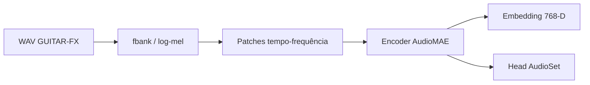
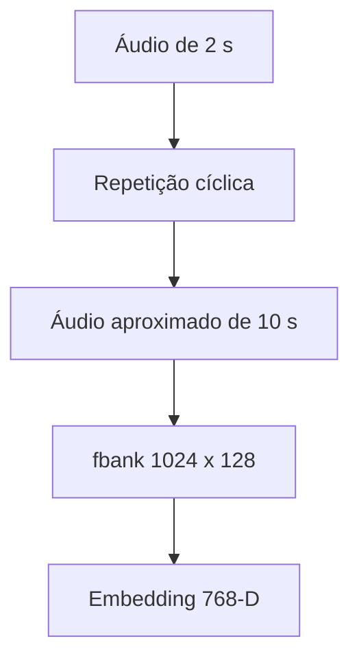
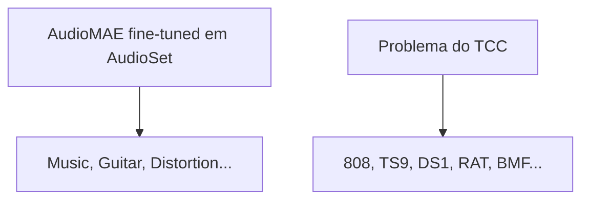
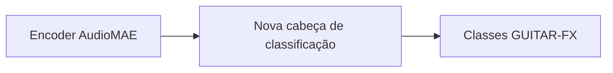

## Experimento com AudioMAE e embeddings de timbre

Como continuidade do estudo sobre **Transformers em áudio**, reproduzimos localmente o artigo **AudioMAE** e testamos o modelo com dados do **GUITAR-FX**.

O objetivo principal não foi usar o AudioMAE como classificador pronto, mas verificar se o encoder do modelo poderia gerar **representações úteis para análise de timbre**.

---

## Ideia do experimento

O AudioMAE trabalha sobre espectrogramas. O áudio é convertido para uma representação tempo-frequência, dividida em patches e processada por um Transformer.

Em vez de observar apenas a classe final prevista pelo modelo, extraímos a representação interna antes da camada de classificação.



Essa saída intermediária, o **embedding**, representa como o modelo organiza internamente o som. A hipótese é que sons timbricamente parecidos possam ficar próximos nesse espaço.

---

## Como foi feito

Usamos inicialmente o subdataset `Mono_Continuous` do GUITAR-FX.

Foram selecionados:

- 250 exemplos por classe;
- 14 classes de pedais;
- classe `NoFX`;
- total de **3.750 áudios**.

Cada áudio foi convertido em um vetor de **768 dimensões**.

Como os arquivos do GUITAR-FX têm cerca de 2 segundos e o AudioMAE espera entradas mais próximas de 10 segundos, os áudios foram repetidos ciclicamente até atingir a duração esperada. Isso evita que a entrada seja dominada por silêncio.



---

## Visualização dos embeddings

Como não é possível visualizar diretamente vetores de 768 dimensões, usamos técnicas de redução dimensional.

Foram geradas projeções com:

- PCA;
- t-SNE.

O t-SNE foi usado para observar vizinhanças locais entre os embeddings.

> **Inserir aqui a imagem t-SNE dos embeddings**
>
> Sugestão:
>
> ```markdown
> 
> ```


---

## O que observamos

As visualizações mostraram que os pedais **não formaram clusters bem separados** usando o checkpoint atual do AudioMAE.

Há bastante mistura entre classes como `808`, `TS9`, `DS1`, `RAT`, `BMF` e outras. Isso é esperado, porque o modelo usado foi treinado/fine-tuned em **AudioSet**, não em GUITAR-FX.

O AudioSet possui classes amplas, como:

- `Music`;
- `Guitar`;
- `Distortion`;
- `Effects unit`;
- `Synthesizer`.

Ele não possui classes específicas para modelos de pedal.

---

## Interpretação

O experimento indica que o AudioMAE, sem adaptação, captura características gerais do áudio, mas ainda não separa naturalmente os pedais por identidade.

Isso não torna o modelo inútil. Pelo contrário: ele pode ser útil como **extrator de representações**.

Os embeddings podem ser usados para:

- estudar similaridade tímbrica;
- comparar famílias de efeitos;
- visualizar proximidade entre sons;
- treinar classificadores simples sobre os vetores;
- iniciar experimentos de transfer learning.

---

## Relação com classificação

Também testamos o modelo com a cabeça final do AudioSet nos quatro subdatasets principais do GUITAR-FX.

O resultado confirmou uma limitação importante: o modelo retorna classes do AudioSet, não classes do GUITAR-FX.



Por isso, não faz sentido comparar diretamente a saída do AudioMAE com os resultados do FXNet.

Para usar AudioMAE em classificação de pedais, seria necessário adaptar o modelo:



Essa adaptação pode ser feita de duas formas principais:

- **linear probe**: congelar o encoder e treinar apenas a cabeça final;
- **fine-tuning**: ajustar parte ou todo o modelo com dados do GUITAR-FX.

---

## Conclusões preliminares

O experimento reforça que o AudioMAE é relevante para o TCC principalmente como modelo de representação.

As conclusões principais foram:

- o modelo foi reproduzido e executado localmente com sucesso;
- os dados do GUITAR-FX podem ser processados pelo pipeline do AudioMAE;
- os embeddings extraídos ainda não separam claramente os pedais;
- isso ocorre porque o checkpoint usado não foi treinado para a taxonomia do GUITAR-FX;
- ainda assim, os embeddings são promissores para análise de similaridade tímbrica;
- a classificação de pedais com AudioMAE é possível, mas requer fine-tuning ou linear probing.

---

## Próximos passos

Como próximos experimentos, faz sentido:

- extrair embeddings usando o checkpoint `pretrained.pth`, menos enviesado pela classificação do AudioSet;
- comparar os embeddings do `pretrained.pth` com os do `finetuned.pth`;
- treinar uma cabeça simples sobre os embeddings;
- comparar esse resultado com os modelos FXNet;
- avaliar se fine-tuning parcial melhora a separação entre pedais.

Em resumo, o AudioMAE não aparece como uma solução pronta para classificar pedais, mas como uma base interessante para investigar **representações latentes de timbre** em sinais de guitarra processada.
